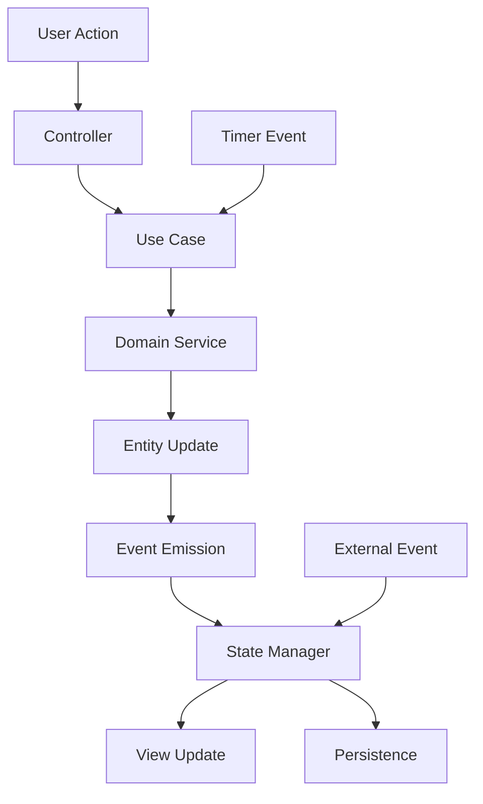
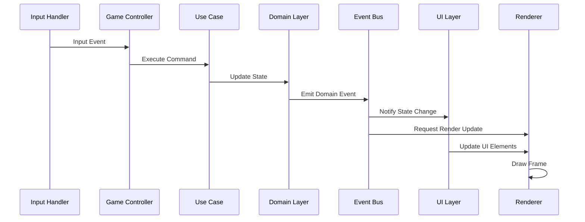

# データフロー設計書

## 1. 概要

本文書では、テトリス生成AIプロジェクトにおけるデータフロー、状態管理、イベントシステムの詳細設計を定義します。オニオンアーキテクチャの原則に従い、単方向データフローと明確な責任分離を実現します。

## 2. データフロー基本原則

### 2.1 単方向データフロー
```
User Input → Controller → Use Case → Domain → Infrastructure → View
```

### 2.2 層間通信原則
- **内向きの依存**: 外側の層は内側の層に依存可能
- **外向きの通信**: 内側の層は外側の層にイベントで通信
- **インターフェース駆動**: 層間の通信はインターフェースを通じて実行

## 3. 状態管理アーキテクチャ

### 3.1 状態管理パターン



### 3.2 状態の種類

#### ゲーム状態（Game State）
```javascript
class GameStateManager {
    constructor() {
        this.state = {
            // ゲームコア状態
            status: 'MENU',              // MENU, PLAYING, PAUSED, GAME_OVER
            board: null,                 // Board インスタンス
            currentPiece: null,          // Tetromino インスタンス
            nextPieces: [],              // Tetromino[]
            holdPiece: null,             // Tetromino | null
            
            // スコア・進行状態
            score: 0,
            level: 1,
            lines: 0,
            gameTime: 0,
            
            // ゲーム設定状態
            settings: {},
            
            // 一時的な状態
            isDropping: false,
            isRotating: false,
            lineClearingAnimation: null,
            
            // 統計・履歴
            statistics: {},
            history: []
        };
        
        this.observers = new Set();
        this.middleware = [];
    }
}
```

#### UI状態（UI State）
```javascript
class UIStateManager {
    constructor() {
        this.state = {
            // 画面状態
            currentView: 'MENU',         // MENU, GAME, SETTINGS, STATS
            menuState: {},
            gameUIState: {},
            
            // インタラクション状態
            isMenuOpen: false,
            activeModal: null,
            focusedElement: null,
            
            // 表示設定
            theme: 'modern',
            animations: true,
            showGrid: true,
            
            // レスポンシブ状態
            screenSize: 'desktop',       // mobile, tablet, desktop
            orientation: 'landscape',    // portrait, landscape
            
            // 入力状態
            inputMethod: 'keyboard',     // keyboard, touch, gamepad
            keysPressed: new Set(),
            
            // アニメーション状態
            activeAnimations: new Map(),
            animationQueue: []
        };
    }
}
```

## 4. イベントシステム設計

### 4.1 イベントバス アーキテクチャ

```javascript
class EventBus {
    constructor() {
        this.listeners = new Map();
        this.middleware = [];
        this.eventHistory = [];
        this.maxHistorySize = 1000;
    }

    /**
     * イベント登録
     * @param {string} eventType - イベントタイプ
     * @param {Function} listener - リスナー関数
     * @param {Object} options - オプション
     */
    on(eventType, listener, options = {}) {
        if (!this.listeners.has(eventType)) {
            this.listeners.set(eventType, new Set());
        }
        
        const wrappedListener = {
            fn: listener,
            once: options.once || false,
            priority: options.priority || 0,
            context: options.context || null
        };
        
        this.listeners.get(eventType).add(wrappedListener);
    }

    /**
     * イベント発行
     * @param {string} eventType - イベントタイプ
     * @param {*} data - イベントデータ
     */
    emit(eventType, data = null) {
        const event = {
            type: eventType,
            data,
            timestamp: Date.now(),
            id: this.generateEventId()
        };

        // ミドルウェア実行
        const processedEvent = this.applyMiddleware(event);
        
        // 履歴記録
        this.recordEvent(processedEvent);
        
        // リスナー実行
        this.executeListeners(processedEvent);
    }

    /**
     * ミドルウェア適用
     */
    applyMiddleware(event) {
        return this.middleware.reduce((processedEvent, middleware) => {
            return middleware(processedEvent) || processedEvent;
        }, event);
    }

    /**
     * リスナー実行
     */
    executeListeners(event) {
        const listeners = this.listeners.get(event.type);
        if (!listeners) return;

        // 優先度順にソート
        const sortedListeners = Array.from(listeners)
            .sort((a, b) => b.priority - a.priority);

        sortedListeners.forEach(listener => {
            try {
                if (listener.context) {
                    listener.fn.call(listener.context, event);
                } else {
                    listener.fn(event);
                }

                // 一度だけのリスナーを削除
                if (listener.once) {
                    listeners.delete(listener);
                }
            } catch (error) {
                console.error(`Error in event listener for ${event.type}:`, error);
            }
        });
    }
}
```

### 4.2 イベント分類

#### ドメインイベント
```javascript
const DomainEvents = {
    // ゲーム状態変更
    GAME_STARTED: 'game.started',
    GAME_PAUSED: 'game.paused',
    GAME_RESUMED: 'game.resumed',
    GAME_ENDED: 'game.ended',
    
    // ピース関連
    PIECE_SPAWNED: 'piece.spawned',
    PIECE_MOVED: 'piece.moved',
    PIECE_ROTATED: 'piece.rotated',
    PIECE_DROPPED: 'piece.dropped',
    PIECE_LOCKED: 'piece.locked',
    PIECE_HELD: 'piece.held',
    
    // ボード変更
    BOARD_UPDATED: 'board.updated',
    LINES_CLEARED: 'lines.cleared',
    LINES_COMPLETED: 'lines.completed',
    
    // スコア・レベル
    SCORE_UPDATED: 'score.updated',
    LEVEL_CHANGED: 'level.changed',
    
    // 特殊動作
    TSPIN_DETECTED: 'tspin.detected',
    COMBO_ACHIEVED: 'combo.achieved',
    PERFECT_CLEAR: 'perfect.clear'
};
```

#### アプリケーションイベント
```javascript
const ApplicationEvents = {
    // アプリケーション制御
    APP_INITIALIZED: 'app.initialized',
    APP_ERROR: 'app.error',
    APP_SHUTDOWN: 'app.shutdown',
    
    // ゲーム制御
    GAME_LOOP_STARTED: 'gameLoop.started',
    GAME_LOOP_STOPPED: 'gameLoop.stopped',
    FRAME_RENDERED: 'frame.rendered',
    
    // 入力処理
    INPUT_RECEIVED: 'input.received',
    INPUT_PROCESSED: 'input.processed',
    
    // データ永続化
    STATE_SAVED: 'state.saved',
    STATE_LOADED: 'state.loaded',
    SETTINGS_CHANGED: 'settings.changed'
};
```

#### UIイベント
```javascript
const UIEvents = {
    // 画面遷移
    VIEW_CHANGED: 'ui.view.changed',
    MODAL_OPENED: 'ui.modal.opened',
    MODAL_CLOSED: 'ui.modal.closed',
    
    // ユーザーインタラクション
    BUTTON_CLICKED: 'ui.button.clicked',
    MENU_SELECTED: 'ui.menu.selected',
    SETTING_CHANGED: 'ui.setting.changed',
    
    // アニメーション
    ANIMATION_STARTED: 'ui.animation.started',
    ANIMATION_COMPLETED: 'ui.animation.completed',
    
    // レスポンシブ
    SCREEN_RESIZED: 'ui.screen.resized',
    ORIENTATION_CHANGED: 'ui.orientation.changed'
};
```

## 5. ゲームループ データフロー

### 5.1 メインループ構造

```javascript
class GameLoop {
    constructor(gameState, renderer, inputHandler, eventBus) {
        this.gameState = gameState;
        this.renderer = renderer;
        this.inputHandler = inputHandler;
        this.eventBus = eventBus;
        
        this.isRunning = false;
        this.lastFrameTime = 0;
        this.targetFPS = 60;
        this.frameInterval = 1000 / this.targetFPS;
        
        this.updateQueue = [];
        this.renderQueue = [];
    }

    start() {
        this.isRunning = true;
        this.lastFrameTime = performance.now();
        this.eventBus.emit(ApplicationEvents.GAME_LOOP_STARTED);
        this.tick();
    }

    tick() {
        if (!this.isRunning) return;

        const currentTime = performance.now();
        const deltaTime = currentTime - this.lastFrameTime;

        if (deltaTime >= this.frameInterval) {
            this.update(deltaTime);
            this.render(deltaTime);
            this.lastFrameTime = currentTime;
        }

        requestAnimationFrame(() => this.tick());
    }

    update(deltaTime) {
        // 1. 入力処理
        this.processInput();
        
        // 2. ゲームロジック更新
        this.updateGameLogic(deltaTime);
        
        // 3. アニメーション更新
        this.updateAnimations(deltaTime);
        
        // 4. UI状態更新
        this.updateUI(deltaTime);
        
        // 5. 更新キュー処理
        this.processUpdateQueue();
    }

    render(deltaTime) {
        // 1. レンダリング準備
        this.renderer.beginFrame(deltaTime);
        
        // 2. ゲーム要素描画
        this.renderGame();
        
        // 3. UI要素描画
        this.renderUI();
        
        // 4. エフェクト描画
        this.renderEffects();
        
        // 5. レンダリング完了
        this.renderer.endFrame();
        
        this.eventBus.emit(ApplicationEvents.FRAME_RENDERED, { deltaTime });
    }
}
```

### 5.2 更新フロー詳細



## 6. 状態同期メカニズム

### 6.1 状態スナップショット

```javascript
class StateSnapshot {
    constructor(gameState) {
        this.timestamp = Date.now();
        this.frameId = this.generateFrameId();
        this.state = this.captureState(gameState);
        this.checksum = this.calculateChecksum(this.state);
    }

    captureState(gameState) {
        return {
            board: gameState.board.serialize(),
            currentPiece: gameState.currentPiece?.serialize(),
            nextPieces: gameState.nextPieces.map(p => p.serialize()),
            holdPiece: gameState.holdPiece?.serialize(),
            score: gameState.score,
            level: gameState.level,
            lines: gameState.lines,
            gameTime: gameState.gameTime
        };
    }

    restore(gameState) {
        gameState.board = Board.deserialize(this.state.board);
        gameState.currentPiece = this.state.currentPiece ? 
            Tetromino.deserialize(this.state.currentPiece) : null;
        gameState.nextPieces = this.state.nextPieces.map(p => 
            Tetromino.deserialize(p));
        gameState.holdPiece = this.state.holdPiece ? 
            Tetromino.deserialize(this.state.holdPiece) : null;
        gameState.score = this.state.score;
        gameState.level = this.state.level;
        gameState.lines = this.state.lines;
        gameState.gameTime = this.state.gameTime;
    }
}
```

### 6.2 差分更新システム

```javascript
class StateDelta {
    constructor(oldState, newState) {
        this.changes = this.calculateChanges(oldState, newState);
        this.timestamp = Date.now();
    }

    calculateChanges(oldState, newState) {
        const changes = {};

        // 深い比較による変更検出
        Object.keys(newState).forEach(key => {
            if (!this.deepEqual(oldState[key], newState[key])) {
                changes[key] = {
                    old: oldState[key],
                    new: newState[key]
                };
            }
        });

        return changes;
    }

    apply(state) {
        Object.keys(this.changes).forEach(key => {
            state[key] = this.changes[key].new;
        });
    }

    reverse(state) {
        Object.keys(this.changes).forEach(key => {
            state[key] = this.changes[key].old;
        });
    }
}
```

## 7. パフォーマンス最適化

### 7.1 バッチ処理

```javascript
class BatchProcessor {
    constructor(eventBus) {
        this.eventBus = eventBus;
        this.batchQueue = [];
        this.batchSize = 50;
        this.batchTimeout = 16; // 1 frame at 60fps
    }

    addToBatch(operation) {
        this.batchQueue.push(operation);
        
        if (this.batchQueue.length >= this.batchSize) {
            this.processBatch();
        } else {
            this.scheduleBatchProcessing();
        }
    }

    processBatch() {
        if (this.batchQueue.length === 0) return;

        const batch = this.batchQueue.splice(0, this.batchSize);
        
        // バッチ処理実行
        const results = batch.map(operation => {
            try {
                return operation.execute();
            } catch (error) {
                console.error('Batch operation failed:', error);
                return null;
            }
        });

        this.eventBus.emit('batch.processed', { 
            count: batch.length, 
            results 
        });
    }
}
```

### 7.2 メモ化とキャッシュ

```javascript
class StateCache {
    constructor(maxSize = 1000) {
        this.cache = new Map();
        this.maxSize = maxSize;
        this.accessOrder = [];
    }

    get(key) {
        if (this.cache.has(key)) {
            this.updateAccessOrder(key);
            return this.cache.get(key);
        }
        return null;
    }

    set(key, value) {
        if (this.cache.size >= this.maxSize) {
            this.evictLeastRecentlyUsed();
        }

        this.cache.set(key, value);
        this.updateAccessOrder(key);
    }

    updateAccessOrder(key) {
        const index = this.accessOrder.indexOf(key);
        if (index > -1) {
            this.accessOrder.splice(index, 1);
        }
        this.accessOrder.push(key);
    }

    evictLeastRecentlyUsed() {
        const lruKey = this.accessOrder.shift();
        if (lruKey) {
            this.cache.delete(lruKey);
        }
    }
}
```

## 8. エラーハンドリングとリカバリ

### 8.1 エラー処理フロー

```javascript
class ErrorHandler {
    constructor(eventBus, stateManager) {
        this.eventBus = eventBus;
        this.stateManager = stateManager;
        this.errorHistory = [];
        this.recoveryStrategies = new Map();
    }

    handleError(error, context = {}) {
        const errorEvent = {
            error,
            context,
            timestamp: Date.now(),
            stackTrace: error.stack,
            gameState: this.stateManager.getCurrentState()
        };

        this.errorHistory.push(errorEvent);
        this.eventBus.emit(ApplicationEvents.APP_ERROR, errorEvent);

        // リカバリ戦略実行
        this.executeRecoveryStrategy(error, context);
    }

    executeRecoveryStrategy(error, context) {
        const strategy = this.getRecoveryStrategy(error.type || error.name);
        
        if (strategy) {
            try {
                strategy.execute(error, context, this.stateManager);
            } catch (recoveryError) {
                console.error('Recovery strategy failed:', recoveryError);
                this.fallbackRecovery();
            }
        } else {
            this.fallbackRecovery();
        }
    }

    fallbackRecovery() {
        // 最後の安定状態に復元
        const lastStableState = this.stateManager.getLastStableState();
        if (lastStableState) {
            this.stateManager.restoreState(lastStableState);
            this.eventBus.emit('state.restored', { 
                reason: 'error_recovery' 
            });
        }
    }
}
```

### 8.2 状態検証

```javascript
class StateValidator {
    constructor() {
        this.validationRules = new Map();
        this.setupDefaultRules();
    }

    setupDefaultRules() {
        this.addRule('board.integrity', (state) => {
            const board = state.board;
            return board && 
                   board.grid &&
                   board.grid.length === 20 &&
                   board.grid[0].length === 10;
        });

        this.addRule('piece.position', (state) => {
            const piece = state.currentPiece;
            if (!piece) return true;
            
            return piece.position.x >= 0 && 
                   piece.position.x < 10 &&
                   piece.position.y >= 0 && 
                   piece.position.y < 20;
        });

        this.addRule('score.consistency', (state) => {
            return state.score >= 0 && 
                   state.level >= 1 && 
                   state.lines >= 0;
        });
    }

    validate(state) {
        const violations = [];

        for (const [ruleName, rule] of this.validationRules) {
            try {
                if (!rule(state)) {
                    violations.push({
                        rule: ruleName,
                        message: `Validation failed for rule: ${ruleName}`
                    });
                }
            } catch (error) {
                violations.push({
                    rule: ruleName,
                    message: `Error executing rule: ${error.message}`
                });
            }
        }

        return {
            isValid: violations.length === 0,
            violations
        };
    }
}
```

## 9. デバッグとモニタリング

### 9.1 状態デバッガー

```javascript
class StateDebugger {
    constructor(stateManager, eventBus) {
        this.stateManager = stateManager;
        this.eventBus = eventBus;
        this.stateHistory = [];
        this.eventLog = [];
        this.isRecording = false;
    }

    startRecording() {
        this.isRecording = true;
        this.stateHistory = [];
        this.eventLog = [];

        this.eventBus.on('*', (event) => {
            if (this.isRecording) {
                this.eventLog.push({
                    ...event,
                    stateSnapshot: this.stateManager.createSnapshot()
                });
            }
        });
    }

    stopRecording() {
        this.isRecording = false;
    }

    exportDebugData() {
        return {
            stateHistory: this.stateHistory,
            eventLog: this.eventLog,
            metadata: {
                recordingStart: this.stateHistory[0]?.timestamp,
                recordingEnd: this.stateHistory[this.stateHistory.length - 1]?.timestamp,
                totalEvents: this.eventLog.length,
                totalStateChanges: this.stateHistory.length
            }
        };
    }

    replayEvents(events) {
        events.forEach((event, index) => {
            setTimeout(() => {
                this.eventBus.emit(event.type, event.data);
            }, event.timestamp - events[0].timestamp);
        });
    }
}
```

## 10. まとめ

この設計書により、以下の目標を達成します：

### 達成される品質
- **保守性**: 明確な責任分離により、コードの理解と修正が容易
- **テスタビリティ**: 各層が独立してテスト可能
- **拡張性**: 新機能の追加が既存コードに影響を与えない
- **信頼性**: エラーハンドリングと状態検証による安定性
- **パフォーマンス**: 最適化されたデータフローと処理

### 実装ガイドライン
1. **段階的実装**: コア機能から順次実装
2. **テスト駆動**: 各コンポーネントのテストを先行実装
3. **継続的検証**: 状態整合性の定期的な検証
4. **パフォーマンス監視**: フレームレートと応答性の監視

この設計に基づいて、高品質で保守性の高いテトリスゲームを構築することができます。
