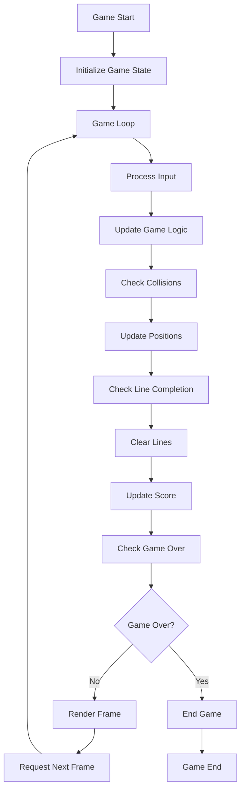
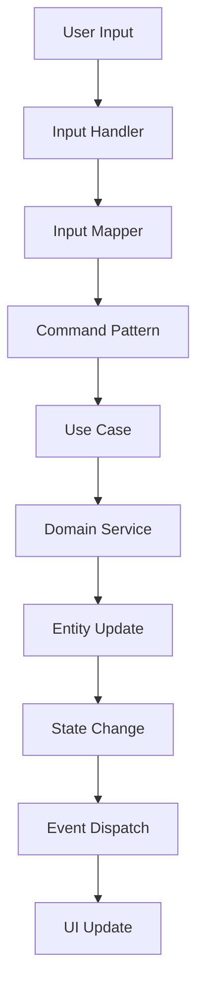
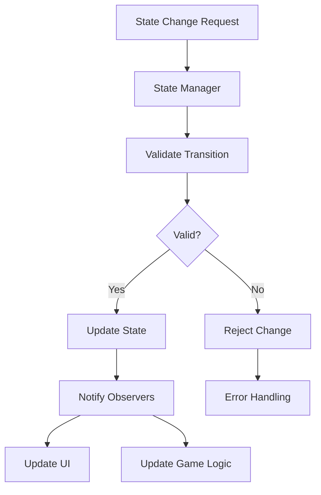

# テトリス生成AI - 詳細設計書

## 1. 概要

### 1.1 プロジェクト概要
- **プロジェクト名**: テトリス生成AI
- **アーキテクチャ**: オニオンアーキテクチャ
- **技術スタック**: HTML5 Canvas + Pure JavaScript (ES6+)
- **テスト戦略**: テスト駆動開発 (TDD)

### 1.2 設計原則
- **関心の分離**: 各層は明確に定義された責任を持つ
- **依存性逆転**: 内側の層は外側の層に依存しない
- **テスタビリティ**: 全コンポーネントが単体テスト可能
- **拡張性**: 新機能の追加が容易
- **保守性**: コードの理解と修正が容易

## 2. アーキテクチャ設計

### 2.1 オニオンアーキテクチャの層構造

```
┌─────────────────────────────────────────────┐
│              Infrastructure                 │  ← 外側の層
│  ┌─────────────────────────────────────┐    │
│  │           Application               │    │
│  │  ┌─────────────────────────────┐    │    │
│  │  │         Core Domain         │    │    │  ← 内側の層
│  │  │                             │    │    │
│  │  │  - Entities                 │    │    │
│  │  │  - Value Objects            │    │    │
│  │  │  - Domain Services          │    │    │
│  │  │                             │    │    │
│  │  └─────────────────────────────┘    │    │
│  │                                     │    │
│  │  - Use Cases                        │    │
│  │  - Application Services             │    │
│  │  - Interfaces (Ports)              │    │
│  │                                     │    │
│  └─────────────────────────────────────┘    │
│                                             │
│  - UI Controllers                           │
│  - External APIs                            │
│  - Database Adapters                        │
│  - Web Framework                            │
│                                             │
└─────────────────────────────────────────────┘
```

### 2.2 ディレクトリ構造詳細

```
js/
├── core/                           # ドメイン層 (内側)
│   ├── entities/                   # エンティティ
│   │   ├── Board.js               # ゲームボード
│   │   ├── Tetromino.js           # テトロミノピース
│   │   ├── GameState.js           # ゲーム状態
│   │   ├── Score.js               # スコア
│   │   ├── Level.js               # レベル
│   │   └── Position.js            # 座標
│   ├── valueObjects/              # 値オブジェクト
│   │   ├── Coordinate.js          # 座標値オブジェクト
│   │   ├── Color.js               # 色値オブジェクト
│   │   ├── Shape.js               # 形状値オブジェクト
│   │   └── Direction.js           # 方向値オブジェクト
│   ├── services/                  # ドメインサービス
│   │   ├── CollisionDetector.js   # 衝突検知
│   │   ├── LineDetector.js        # ライン検知
│   │   ├── ScoreCalculator.js     # スコア計算
│   │   └── TetrominoFactory.js    # テトロミノ生成
│   └── interfaces/                # インターフェース定義
│       ├── IRenderer.js           # レンダラー
│       ├── IInputHandler.js       # 入力ハンドラー
│       ├── IStorageAdapter.js     # ストレージ
│       └── IAudioAdapter.js       # オーディオ
├── application/                   # アプリケーション層
│   ├── usecases/                  # ユースケース
│   │   ├── StartGame.js           # ゲーム開始
│   │   ├── MovePiece.js           # ピース移動
│   │   ├── RotatePiece.js         # ピース回転
│   │   ├── DropPiece.js           # ピース落下
│   │   ├── ClearLines.js          # ライン消去
│   │   ├── PauseGame.js           # ゲーム一時停止
│   │   └── EndGame.js             # ゲーム終了
│   ├── services/                  # アプリケーションサービス
│   │   ├── GameOrchestrator.js    # ゲーム統括
│   │   ├── InputProcessor.js      # 入力処理
│   │   ├── StateManager.js        # 状態管理
│   │   └── EventDispatcher.js     # イベント配信
│   └── ports/                     # ポート（インターフェース実装）
│       ├── GamePort.js            # ゲーム操作ポート
│       ├── RenderPort.js          # レンダリングポート
│       └── InputPort.js           # 入力ポート
├── infrastructure/                # インフラストラクチャ層 (外側)
│   ├── rendering/                 # レンダリング実装
│   │   ├── CanvasRenderer.js      # Canvas描画
│   │   ├── UIRenderer.js          # UI描画
│   │   ├── AnimationRenderer.js   # アニメーション
│   │   └── EffectRenderer.js      # エフェクト
│   ├── input/                     # 入力実装
│   │   ├── KeyboardHandler.js     # キーボード入力
│   │   ├── TouchHandler.js        # タッチ入力
│   │   ├── GamepadHandler.js      # ゲームパッド入力
│   │   └── InputMapper.js         # 入力マッピング
│   ├── storage/                   # ストレージ実装
│   │   ├── LocalStorageAdapter.js # ローカルストレージ
│   │   ├── SessionStorageAdapter.js # セッションストレージ
│   │   └── IndexedDBAdapter.js    # IndexedDB
│   ├── audio/                     # オーディオ実装
│   │   ├── WebAudioAdapter.js     # Web Audio API
│   │   ├── HTMLAudioAdapter.js    # HTML Audio
│   │   └── AudioManager.js        # オーディオ管理
│   └── network/                   # ネットワーク実装
│       ├── WebSocketAdapter.js    # WebSocket
│       └── RestAPIAdapter.js      # REST API
├── presentation/                  # プレゼンテーション層
│   ├── controllers/               # コントローラー
│   │   ├── GameController.js      # ゲームコントローラー
│   │   ├── MenuController.js      # メニューコントローラー
│   │   ├── SettingsController.js  # 設定コントローラー
│   │   └── StatsController.js     # 統計コントローラー
│   ├── views/                     # ビュー
│   │   ├── GameView.js            # ゲーム画面
│   │   ├── MenuView.js            # メニュー画面
│   │   ├── SettingsView.js        # 設定画面
│   │   └── StatsView.js           # 統計画面
│   └── config/                    # 設定
│       ├── GameConfig.js          # ゲーム設定
│       ├── RenderConfig.js        # レンダリング設定
│       └── InputConfig.js         # 入力設定
└── main.js                        # エントリーポイント
```

## 3. データフロー設計

### 3.1 ゲームループフロー



### 3.2 入力処理フロー



### 3.3 状態管理フロー



## 4. 核心エンティティ設計

### 4.1 Board エンティティ

```javascript
class Board {
    constructor(width = 10, height = 20) {
        this.width = width;
        this.height = height;
        this.grid = this.initializeGrid();
        this.placedPieces = new Map();
    }

    // 主要メソッド
    initializeGrid()           // グリッド初期化
    isValidPosition(piece, x, y) // 位置有効性チェック
    placePiece(piece, x, y)    // ピース配置
    removePiece(x, y)          // ピース削除
    getCompleteLines()         // 完成ライン取得
    clearLines(lineNumbers)    // ライン消去
    isGameOver()               // ゲームオーバー判定
    clone()                    // ボード複製
    serialize()                // シリアライズ
    deserialize(data)          // デシリアライズ
}
```

### 4.2 Tetromino エンティティ

```javascript
class Tetromino {
    constructor(type, position = {x: 4, y: 0}) {
        this.type = type;
        this.position = position;
        this.shape = this.getShapeMatrix(type);
        this.color = this.getColor(type);
        this.rotationState = 0;
        this.lockDelay = 0;
        this.dropTime = 0;
    }

    // 主要メソッド
    rotate(direction = 'clockwise') // 回転
    move(dx, dy)                   // 移動
    drop()                         // 1マス落下
    hardDrop()                     // ハードドロップ
    getGhostPosition(board)        // ゴースト位置計算
    getOccupiedCells()             // 占有セル取得
    clone()                        // テトロミノ複製
    canKick(board, kickData)       // ウォールキック可能性
}
```

### 4.3 GameState エンティティ

```javascript
class GameState {
    constructor() {
        this.status = 'MENU'; // MENU, PLAYING, PAUSED, GAME_OVER
        this.board = new Board();
        this.currentPiece = null;
        this.nextPieces = [];
        this.holdPiece = null;
        this.score = new Score();
        this.level = new Level();
        this.lines = 0;
        this.startTime = null;
        this.gameTime = 0;
        this.lastUpdate = 0;
    }

    // 主要メソッド
    start()                        // ゲーム開始
    pause()                        // 一時停止
    resume()                       // 再開
    end()                          // ゲーム終了
    update(deltaTime)              // 状態更新
    spawnNextPiece()               // 次ピース生成
    holdCurrentPiece()             // ホールド
    clearLines(lineCount)          // ライン消去処理
    serialize()                    // 状態保存
    deserialize(data)              // 状態復元
}
```

## 5. 主要インターフェース設計

### 5.1 IRenderer インターフェース

```javascript
class IRenderer {
    // 初期化
    initialize(canvas, config) {}
    
    // 描画メソッド
    renderBoard(board) {}
    renderPiece(piece) {}
    renderGhost(piece) {}
    renderNextPieces(pieces) {}
    renderHoldPiece(piece) {}
    renderScore(score) {}
    renderLevel(level) {}
    renderLines(lines) {}
    renderGameTime(time) {}
    
    // エフェクト
    renderLinesClearEffect(lines) {}
    renderDropEffect(piece) {}
    renderLevelUpEffect() {}
    
    // ユーティリティ
    clear() {}
    resize(width, height) {}
    setTheme(theme) {}
}
```

### 5.2 IInputHandler インターフェース

```javascript
class IInputHandler {
    // 初期化
    initialize(element) {}
    
    // イベント登録
    onMoveLeft(callback) {}
    onMoveRight(callback) {}
    onMoveDown(callback) {}
    onRotateClockwise(callback) {}
    onRotateCounterclockwise(callback) {}
    onHardDrop(callback) {}
    onHold(callback) {}
    onPause(callback) {}
    
    // 設定
    setKeyRepeatDelay(delay) {}
    setKeyRepeatRate(rate) {}
    
    // 状態管理
    enable() {}
    disable() {}
    reset() {}
}
```

### 5.3 IStorageAdapter インターフェース

```javascript
class IStorageAdapter {
    // データ操作
    save(key, data) {}
    load(key) {}
    delete(key) {}
    exists(key) {}
    clear() {}
    
    // 設定操作
    saveGameState(state) {}
    loadGameState() {}
    saveHighScores(scores) {}
    loadHighScores() {}
    saveSettings(settings) {}
    loadSettings() {}
    
    // メタデータ
    getStorageInfo() {}
    isAvailable() {}
}
```

これが設計書の第1部です。続いて、詳細なコンポーネント設計を作成いたします。
